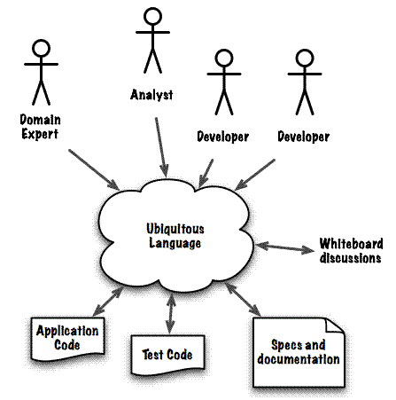

# Clean Architecture

1. 了解价值链
2. 定义领域模型

## 分析价值链

1.  主动学习(内容纪录),思考,完成知识体系构建.这个过程大部分情况可能是发散式的.
2.  学术讨论,研究,思考,实验,结论,模型或理论验证.利用新理论重新构建知识体系认知.

3.  主动学习

    进入一个新领域:

        1. 初步接触一个新领域(A domain),概念(concept).
        2. 是否有足够的好奇心和驱动力去深入了解(A domain).
        3. 计划开始探索(A domain), A domain知识和纲要体系收集,
        4. A domain知识纲要完成初步收集后开始列出学习计划.
        5. A domain知识维度的逐步升维.

## Patterns


## 商业模式图和公司运作

## DDD

DDD 软件设计的策略逻辑:

首先 DDD 并不是要求你的团队去使用某些 Patterns (event sourcing,repositories patterns)

DDD 核心是如何解构一个复杂的问题,将问题变为一个个小问题,当小问题都解决的时候大问题就解决了.

### DDD 流程

1. 寻求领域专家合作定义领域模型(Module Model)和各个领域的领域词汇(Domain Terms),通用语言(ubiquitous language)

   1. 领域模型(Module Model)
   2. 领域词汇(Domain Terms)
   3. 通用语言(ubiquitous language)

2. 利用 Domain Model 和 ubiquitous language 来实现你的系统.

   不论(class name, structure name, type name, method name, event name, variable name),都应该使用 Domain Terms 去定义, 如此一来, 你的产品和工程团队,和商业团队可以使用同样的词汇来沟通和讨论.

3. 定义系统的范围.

   除非你是从头开始为一个复杂的商业流程设计一个系统，否则你一定会接触旧有的系统，这些旧系统显然的不会去遵循你所定义的新词汇，这是你必须要清楚的划清系统的范围 （Boundaries） ，并在新旧系统间，定义一个 Translator / Anti-Corruption Layer，你不需要去对旧有的系统做全盘的更新，而是利用 Anti-Corruption Layer 去定义系统的范围和清楚的指出新旧系统之间的对应关系。

   简单点理解就是包一层.用这层来做 Translator/Anti-Corruption Layer.

### DDD 结构

1. Domain:

   1. Entities
   2. UseCases

2. Application:

3. Infrastructure:

   1. Web
   2. Devices
   3. DB
   4. UI
   5. External Interfaces

4. Adapter:

   适配器.
   Adapter 是 microServices 的边界.

### 定义领域模型(Domain Model)

1. 核心关注点是和领域专家(Domain Experts)合作定义(Domain Model),抽取 Domain Terms 和 ubiquitous language.



2. 目标输出:

   1. Domain Terms
   2. ubiquitous language

#### 我们从一个案例来展开如何定义领域模型:

我们和领域专家沟通, 传统的出版业是这样的:
出版社拥有申请出版号的牌照,普通人没法直接出书,因此普通人出书的意愿就是一个问题.出版社的员工(编辑)了解市场的读者需求哪一类书籍,寻找创作者(作者或者翻译者)来写作(write book).完成创作或翻译后,编辑负责修订,并完成后续的出书和市场的一系列行为,因为我们的关注点并不是把出版社流程搬到网上来,所以我们并不打算在这里展开整个出版业的详细信息;

我们观察到几个核心的问题, 一个是书籍(book), 一个是作者(author),整个出版社是围绕着这 2 个服务的.

我有一种想法是使用系统去取代出版社这种上个世纪的模式.

1. 商业价值:

   主动创作,没有繁复的出版流程,和读者有反馈,调整创作的内容.内容是为读者服务,而非简单定义为知识.

#### 决定产品策略:

在定义出子领域，通用语言之后，你的团队和产品经理根据你们对各个领域的了解，必须要做出要对哪些子领域作出投资以达到产品或商业流程差异化的效果。

1. 核心子领域(Core subDomains)

   核心子领域是你的公司和产品的竞争优势，也是你商业流程的基础，在这些子领域持续的投资和创新是你公司成长的基石。 你会将你最优秀的团队成员放在子领域的项目，以期他们能持续的创新。

2. 支持子领域(Supporting subDomains)

   支持子领域是用来支持核心子领域的系统和使用案例，这些子领域是这个系统不可或缺的一部分，但并不会为你的产品和公司带来竞争优势。 在软件系统的投资来说，你会将较资浅的成员放在这类的项目，或是说让你的资深团队一次性的建置好此类系统，之后只进行维护的动作。

3. 一般子领域(Generic subDomains)

   一般子领域是那些你需要的系统功能，但市场上已经有非常多类似的产品，没有理由去对这部分的功能进行投资，而是需要找到适合的厂商来支持这类子领域的功能。

##### 工程结构

```sh
CoreSubDomain/
SupportingSubDomains/
GenericSubDomains/
Shared/
```

##### 计划案例

1. 一开始用户进入最小创作(Writer Articles), domain Articles , 这个是 Core subDomains.

2. 这个(domain Articles)需要 logs in & change password, 这个是 Indentiy and Access subDomains.

3. 有些 Article 是需要付费才能看的. payment subDomains.

4. payment 就意味着会有发票(Invoice)的需求, 这个是 Financial Transaction subDomains.

5. 用户一边学习,一边创作的过程中,慢慢形成知识体系之后可以出书(book)或者开课(Course)

6. 多个用户可以一起协作创作完成线上或发起线下的 Course 培训.

接下来我们的创业目标集中在 Core subDomains 上,初期先实现基本的 Article subDomains,然后在把 Write
Articles 扩展成一个个人终身学习的写作,学习,和整理成体系的习惯.

#### Domain Terms & ubiquitous language

为了不让我们的目标变成空谈,我们先实现最基本的 Article subDomains.

写书太久,我们先从一个简单的 Article 开始,作者(Author) 写作(Write article),读者(Reader)阅读(View),一个 Author 也可能是一个 Reader, 他们都是我们的客户(Customer),仅当 Customer 在 Writer Article 的时候是 Author, 在阅读的时候是 Reader.

Article subDomains

1. Terms:

2. ubiquitous language

因此我们得到 2 个 Entities:

    1. Article
    2. Customer

1. Article
